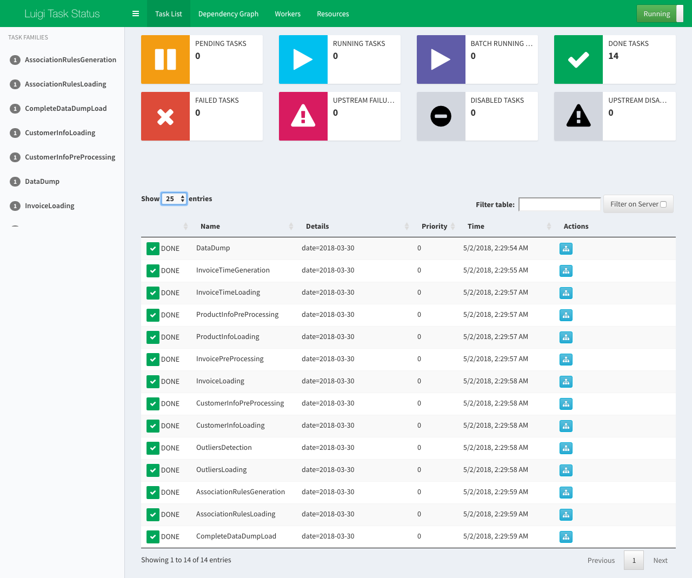
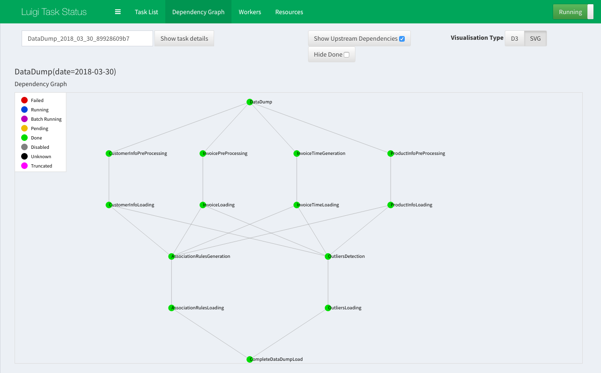
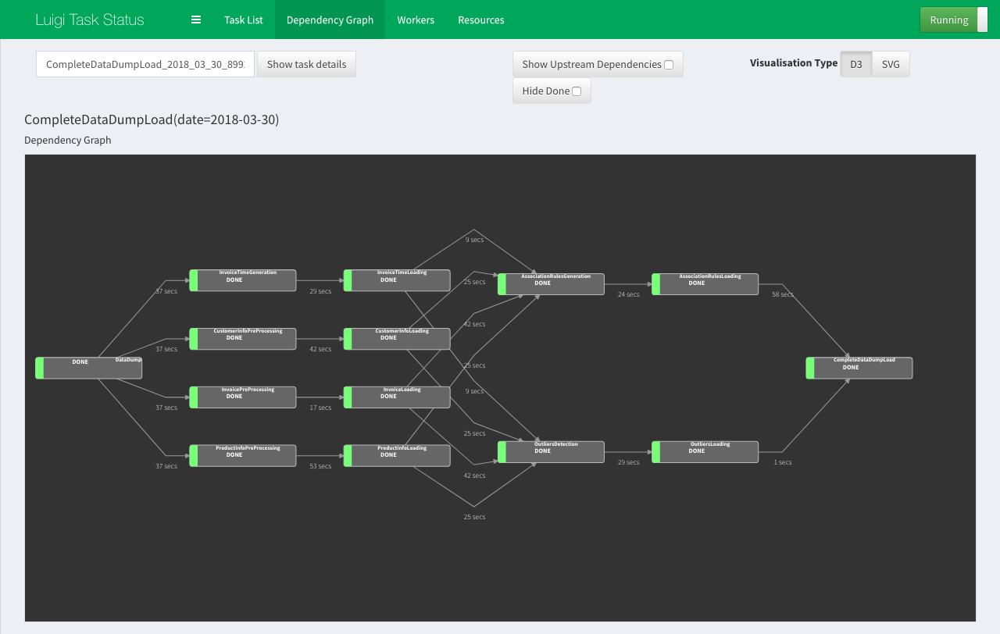
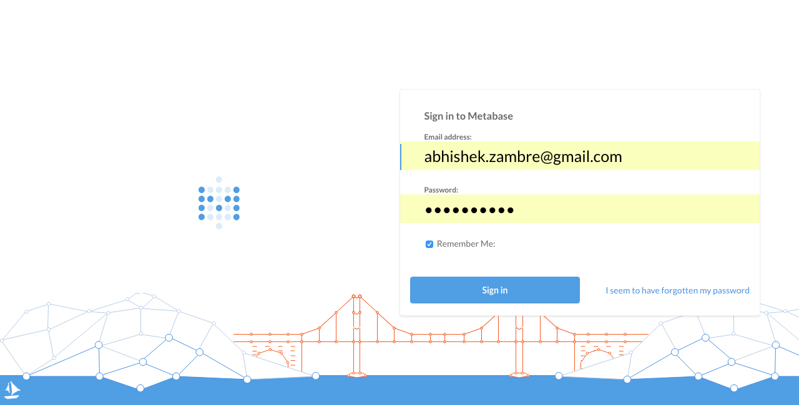
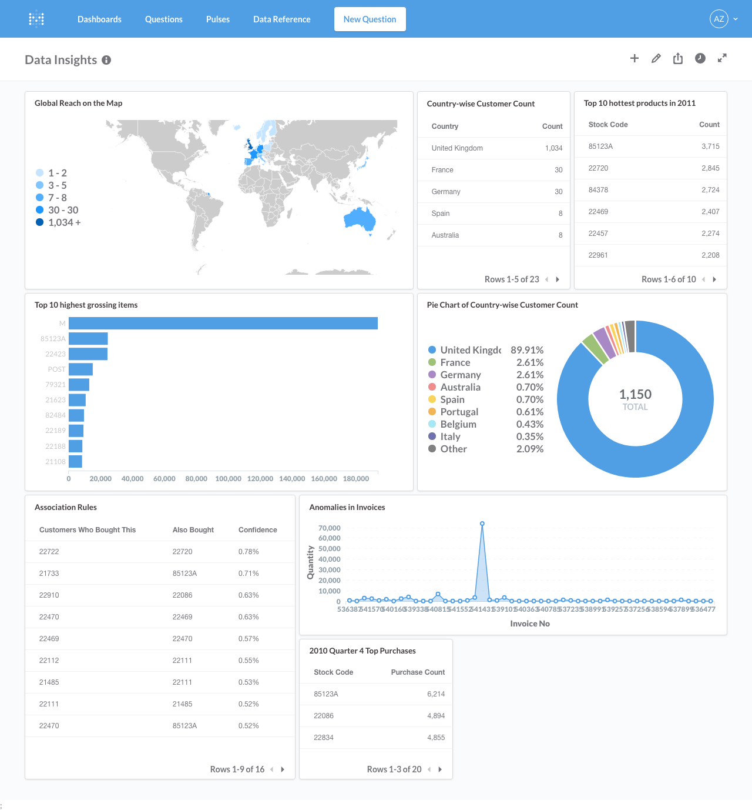

# Data Warehouse

## Introduction

This project is to develop a Data Warehouse infrastructure.
For this, I used [Luigi](https://github.com/spotify/luigi) for Data Pipeline, [PostgreSQL](https://www.postgresql.org/)
as a Backend Database, and [Metabase](https://www.metabase.com/) library for Data Insights Dashboard.

Below are the three main components of this project.

1) Build a data pipeline to store the provided data in a data store. This should be representative of a miniature data
warehouse.

2) Anomaly Detection such as questionable data values, missing data etc.

3) Data Insight to the merchant for improving her/his business.

## Environment Setup

The system is developed and tested on the environment with the below configurations.

- [macOS](https://www.apple.com/macos/high-sierra/): For development & testing (Recommended)
- [Ubuntu 16.04.4](https://www.ubuntu.com/download/desktop): For further testing
- [Python 3.5.2](https://www.python.org/downloads/)
- [PostgreSQL](https://www.postgresql.org/download/macosx/)
- [Metabase](https://www.metabase.com/): Download the jar file (version: 0.28.6) from [here](https://www.metabase.com/start/jar.html).
- [Java SE 1.8](http://www.oracle.com/technetwork/java/javase/downloads/index.html)
- [Postico](https://eggerapps.at/postico/): PostgreSQL Client for macOS (Optional)
- [pip](https://pypi.org/project/pip/)

Please install below set of python3 modules. Please install if any missing dependency for below modules.
- [Luigi](https://github.com/spotify/luigi)
```
pip3 install luigi
```
- [psycopg2](http://initd.org/psycopg/)
```
pip3 install psycopg2
```
- [pandas](https://pandas.pydata.org/)
```
pip3 install pandas
```
- [mlxtend](https://github.com/rasbt/mlxtend)
```
pip3 install mlxtend
```
- [pycountry](https://pypi.org/project/pycountry/)
```
pip3 install pycountry
```

## Getting Environment Up and Running

Once all required softwares and modules are installed. Now its time to bring the system up.


####PostgreSQL
- Check if PostgreSQL server is up and running
```
brew services list
```
- To start PostgreSQL server
```
brew services start postgresql
```
- Login to postgres user
```
psql postgres
```
- Create user called "abhishekzambre"
```
sudo -u postgres createuser --interactive
```
- Set password for user "abhishekzambre" to "sky" (without quotes)
```
\password abhishekzambre
```
- Create a new database called "sales_dw"
```
createdb sales_dw
```
Please note, above three steps are necessary in order for Metabase to run properly. If you create user with different 
name, set different password, or created database with different name, then you will have to update data source
configurations of Metabase accordingly.
- Use below command if you want to enter interactive postgres session
```
psql
```

####Luigi
- Use below command to start luigi daemon. Once it is up and running, navigate to [http://localhost:8082/](http://localhost:8082/)
```
luigid
```
- Please make sure the link is working

####Metabase
- Download the jar file (version: 0.28.6) from [here](https://www.metabase.com/start/jar.html)
- Once downloaded, keep the jar file in the Metabase directory of provided source code of this project
- Make sure metabase.db.trace.db and metabase.db.mv.db files are present in the Metabase directory
- Please note all three files (jar and db) needs to be placed in same directory
- Use below command to start Metabase instance. Once it is up and running, navigate to [http://localhost:3000/](http://localhost:3000/)
- Please make sure the link is working
- User credentials can be found in the credentials section

##Executing Main Program
- Unzip the provided source code zip file
- Make sure data_pipeline.py file is present
- Program expects a directory called data, which will contain data dumps in directory with name in YYYY_MM_DD format (for ex. data/2018_03_30/)
- Place all csv files in directory
- Directory contains should look like below
```
data\2018_03_30\customer_info.csv data\2018_03_30\invoice.csv data\2018_03_30\product_info.csv
```
- We are now ready to execute the program
- Execute below command, and check Luigi UI link for status updates
```
PYTHONPATH='.' luigi --module data_pipeline CompleteDataDumpLoad --date 2018-03-30
```
- For running program locally (i.e. without UI updates), use below command
```
PYTHONPATH='.' luigi --module data_pipeline CompleteDataDumpLoad --local-scheduler --date 2018-03-30
```

##Output Verification
- Navigae to Luigi UI, which should display task status as below



- Click on "Actions" link of DataDump task to see Dependency Graph (uncheck "Hide Done", and check "Show Upstream Dependencies")



- Click on "Actions" link of CompleteDataDumpLoad task, (uncheck "Hide Done", and change Visualisation Type to "D3", to get details pipeline view)




##Database Verification
- Launch PostgreSQL client, and look for below list of tables
    * customer_info
    * invoice
    * invoice_time
    * product_info
    * association_rules
    * invoice_outliers

- If any table is missing, check luigi logs for any errors or exception

##Data Insights Dashboard
- Navigate to Metabase dashboard, and enter the provided credentials



- Once logged in, click on "Dashboards" on upper-left corner, and click on "Data Insights" dashboard



##Credentials
- PostgreSQL
    * Admin user: abhishekzambre
    * Password: sky

- Metabase
    * Admin User: abhishek.zambre@gmail.com
    * Password: skyrim@123
    * Business Owner User: owner@somebusiness.com
    * Password: FoE7IIcLO6q74g

##Authors
* **Abhishek Zambre** - [abhiz.me](http://abhiz.me)